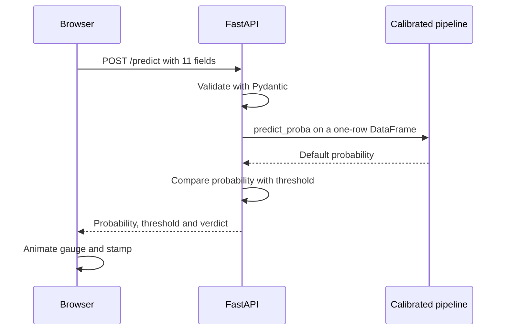

<div align="center">


<br>


<br><br>
---

<div align="center">

**[Overview](#overview)** · **[How it works](#how-it-works)** · **[Model performance](#model-performance)** · **[API](#api-reference)** · **[Quick start](#quick-start)** · **[Deploy](#deploy-on-render)** · **[Known issues](#known-issues-and-roadmap)**

</div>

---
</div>

<!-- Once the Render service is live, add it here:
**Live demo:** https://your-service.onrender.com
-->

## Overview

Credit Ledger scores a consumer-loan application for default risk. You enter eleven fields about the applicant, the loan and their credit file. It returns the probability that the loan defaults, plus a **Low Risk** or **High Risk** verdict.

The project has three parts:

- **Model.** An XGBoost classifier trained on 31,522 cleaned loan records, tuned with a 150-candidate randomized search, with sigmoid-calibrated probabilities. It reaches a ROC-AUC of 0.95 on held-out data.
- **API.** A FastAPI service that validates the input, runs the saved scikit-learn pipeline and compares the probability with a stored threshold.
- **Interface.** A framework-free page (one HTML file, one stylesheet, one script) that shows the answer as a gauge and a stamp.

The notebook goes further than the app does. It also trains a logistic-regression baseline, checks calibration, and explains predictions with SHAP.

## Features

- **Honest probabilities.** The tuned model is wrapped in sigmoid calibration, so a 30% score should mean that roughly 30% of similar loans default.
- **Built for imbalance.** About one loan in five defaults, so training uses `scale_pos_weight` (3.63), stratified splits and stratified 5-fold cross-validation.
- **Explainable.** The notebook draws a SHAP summary plot for the whole test set and a waterfall plot that breaks one applicant's score down feature by feature.
- **Validated API.** Pydantic checks every field. The model loads once at startup, and interactive docs are served at `/docs`.
- **A small, readable UI.** Loan-to-income is calculated for you (and can be overridden), the header shows whether the service is reachable, the gauge marks the decision threshold, and animation stops for visitors who prefer reduced motion.
- **One-file deploy.** `render.yaml` describes the whole service for Render.

## How it works

<p align="center">
  
</p>

| Stage | What happens |
| --- | --- |
| **Dataset** | 32,581 loans, 11 input features and a `loan_status` target (1 = default). The raw default rate is 21.8%. |
| **Clean** | Drop 165 duplicate rows. Keep ages 18 to 100, employment length no longer than the applicant's age and at most 60 years, and loan amounts above zero. The employment-length filter also drops rows where that value is blank. 31,522 rows remain. |
| **Preprocess** | A `ColumnTransformer` fills numeric gaps with the median (3,027 interest rates are still blank after cleaning, and the imputer also covers blanks at prediction time) and one-hot encodes the four categorical columns. The logistic-regression baseline also scales numeric columns. |
| **Tune** | `RandomizedSearchCV` tries 150 candidates across 5 folds (750 fits), scored on average precision. The winner uses 515 trees of depth 8 with a learning rate of about 0.093. |
| **Calibrate** | `CalibratedClassifierCV(method="sigmoid", cv=5)` wraps the tuned pipeline. It is saved with `joblib`, and the decision threshold is saved beside it. |
| **Serve** | `main.py` loads both files at startup, answers `POST /predict` and serves the web page. |

When someone presses **Assess risk**, this is what happens:



### Inputs

| Field | Type | Notes |
| --- | --- | --- |
| `person_age` | int | Years |
| `person_income` | float | Annual income |
| `person_home_ownership` | str | `RENT`, `MORTGAGE`, `OWN` or `OTHER` |
| `person_emp_length` | float | Years in current employment |
| `loan_intent` | str | `PERSONAL`, `EDUCATION`, `MEDICAL`, `VENTURE`, `HOMEIMPROVEMENT` or `DEBTCONSOLIDATION` |
| `loan_grade` | str | `A` to `G` |
| `loan_amnt` | float | Amount requested |
| `loan_int_rate` | float | Interest rate in percent |
| `loan_percent_income` | float | `loan_amnt / person_income` as a ratio. The UI calculates it. |
| `cb_person_default_on_file` | str | `Y` or `N` |
| `cb_person_cred_hist_length` | int | Years of credit history |

<details>
<summary><b>Notebook walkthrough</b> (<code>Credit_Risk.ipynb</code>, 16 sections)</summary>

1. Load the data
2. Exploratory data analysis: shape, missing values, target balance, outliers, correlations
3. Data validation and outlier handling
4. Features, target and a stratified 80/20 train-test split
5. Class imbalance
6. Preprocessing pipelines for logistic regression and XGBoost
7. A shared evaluation helper (metrics, confusion matrix, precision-recall curve)
8. Stratified 5-fold cross-validation
9. Baseline model: logistic regression
10. XGBoost hyperparameter tuning
11. Side-by-side comparison
12. Choosing the classification threshold
13. Probability calibration
14. SHAP interpretation, global and local
15. False positive and false negative analysis
16. Saving the model and threshold

</details>

## Model performance

<p align="center">
  
</p>

Everything below uses the same stratified 20% test split (6,305 loans, 1,362 of them defaults) and a 0.5 cut-off.

| Metric | Logistic regression (baseline) | XGBoost (tuned) |
| --- | :---: | :---: |
| Accuracy | 0.82 | **0.93** |
| Precision | 0.56 | **0.87** |
| Recall | 0.79 | 0.79 |
| F1 | 0.65 | **0.83** |

Cross-validation on the training data points the same way. Logistic regression scores a ROC-AUC of 0.871, and XGBoost scores 0.939 before any tuning.

**The deployed model** is the tuned pipeline plus sigmoid calibration. Re-evaluated from `credit_risk_model.pkl` on that same split, it reaches a ROC-AUC of 0.952, a PR-AUC of 0.911 and a Brier score of 0.051. At a 0.5 cut-off it has a precision of 0.92, a recall of 0.77 and an F1 of 0.84, with 90 false positives and 308 false negatives.

The model misses more defaulters than it wrongly flags (section 15 of the notebook). If a missed default costs your lender more than a declined good loan, lower the threshold.

### Decision threshold

The API answers **High Risk** when `default_probability` is at least the value stored in `best_threshold.pkl`. The notebook picks that value from the precision-recall curve by maximizing F1 (section 12). See [Known issues and roadmap](#known-issues-and-roadmap) for the current state of that file.

## API reference

Start the app (see [Quick start](#quick-start)), then call it:

```bash
curl -X POST http://127.0.0.1:8000/predict \
  -H "Content-Type: application/json" \
  -d '{
    "person_age": 22,
    "person_income": 9600,
    "person_home_ownership": "RENT",
    "person_emp_length": 1,
    "loan_intent": "MEDICAL",
    "loan_grade": "G",
    "loan_amnt": 35000,
    "loan_int_rate": 22.5,
    "loan_percent_income": 0.83,
    "cb_person_default_on_file": "Y",
    "cb_person_cred_hist_length": 2
  }'
```

```json
{
  "default_probability": 0.9528,
  "default_prediction": 1,
  "threshold": 0.5702,
  "Result": "High Risk"
}
```

| Response field | Meaning |
| --- | --- |
| `default_probability` | Calibrated probability of default, from 0 to 1 |
| `default_prediction` | `1` if the probability is at or above the threshold, otherwise `0` |
| `threshold` | The cut-off loaded from `best_threshold.pkl` |
| `Result` | `"High Risk"` or `"Low Risk"` |

Two behaviors to know about:

- Wrong types return `422` with Pydantic's error detail. Categorical fields are plain strings, so an unseen value such as `loan_grade: "Z"` is accepted. The one-hot encoder ignores unknown categories, and the model treats them as matching none of the known ones.
- Interactive documentation lives at `/docs`, and the OpenAPI schema at `/openapi.json`. The page's status indicator uses the schema to check that the service is up.

## Project structure

```text
.
├── main.py                    FastAPI app: POST /predict and the static mount
├── credit_risk_model.pkl      Calibrated XGBoost pipeline (preprocessing included)
├── best_threshold.pkl         Probability cut-off for the High Risk verdict
├── Credit_Risk.ipynb          EDA, cleaning, modelling, SHAP and export
├── credit_risk_dataset.csv    Training data (32,581 loans)
├── static/
│   ├── index.html             The form and the verdict panel
│   ├── style.css              Design tokens, gauge and stamp styling
│   └── script.js              Ratio helper, status check, /predict call, animation
├── assets/                    Animated SVGs used by this README
├── requirements.txt           Pinned dependencies
├── render.yaml                Render blueprint
└── .gitignore
```

`main.py` serves the `static/` folder, so keep the three front-end files inside it.

## Quick start

You need Python 3.11 and `pip`.

```bash
git clone <your-repo-url>
cd <your-repo-folder>

python -m venv .venv
source .venv/bin/activate          # Windows: .venv\Scripts\activate
pip install -r requirements.txt

uvicorn main:app --reload
```

Open <http://127.0.0.1:8000> for the interface or <http://127.0.0.1:8000/docs> for the API docs.

### Retrain the model

Open `Credit_Risk.ipynb` in Jupyter or Colab and run every cell. The last two cells overwrite `credit_risk_model.pkl` and `best_threshold.pkl`. Train with the same scikit-learn version that `requirements.txt` pins, because a pickle written by one version warns when another version loads it.

## Deploy on Render

1. Push the repository to GitHub, with the front-end files inside `static/`.
2. In Render, choose **New**, then **Blueprint**, and select the repository. Render reads `render.yaml`.
3. Set the Python version explicitly. Render reads the `PYTHON_VERSION` environment variable or a `.python-version` file, and it does not read `runtime.txt`. Newer services default to a recent Python (3.14 at the time of writing) that the pinned `pandas==2.2.2` predates. The blueprint below sets it:

```yaml
services:
  - type: web
    name: credit-ledger
    runtime: python
    plan: free
    buildCommand: pip install -r requirements.txt
    startCommand: uvicorn main:app --host 0.0.0.0 --port $PORT
    autoDeploy: true
    envVars:
      - key: PYTHON_VERSION
        value: 3.11.9
```

With `autoDeploy: true`, every push to the tracked branch redeploys. Free instances sleep when idle, so the first request after a pause is slow. The status indicator in the page header turns green once the API answers.

## Known issues and roadmap

These are the open items found while documenting the project. Each has a small fix.

- [ ] **Recompute the decision threshold.** `best_threshold.pkl` currently holds about 0.9996, so no applicant is ever flagged High Risk. The F1 line in section 12 of the notebook subtracts where it should multiply, and it runs on the untuned model. With the formula corrected, the F1-optimal cut-off for the deployed model is about 0.57 (F1 0.84 on the test split). Choosing the cut-off on validation or out-of-fold predictions, rather than on the test set, keeps the reported score honest.

  ```python
  f1 = 2 * (precisions * recalls) / (precisions + recalls + 1e-9)
  ```

- [ ] **Return the threshold as a plain float.** It is saved as a `numpy.float32`, which FastAPI cannot serialize, so `/predict` answers `500` until `main.py` converts it.

  ```python
  ml_model['threshold'] = float(joblib.load('best_threshold.pkl'))
  ```

- [ ] **Match library versions.** The notebook ran on scikit-learn 1.9.0 while `requirements.txt` pins 1.6.1, which triggers an `InconsistentVersionWarning` when the model loads. Pin the version used for training, or retrain under the pinned versions.
- [ ] **Align the currency with the training data.** The dataset's amounts are on a different scale from the page's defaults (median income 55,000 and largest loan 35,000, against defaults of ₹600,000 and ₹100,000). Trees treat out-of-range values as the nearest bucket, so scores for large amounts are unreliable. Rescale in the API or relabel the form.
- [ ] **Ideas.** Return the top SHAP drivers with each prediction, add tests for `/predict`, and add a CI workflow.

## Disclaimer

Credit Ledger is a learning project. Its scores are model estimates, not lending decisions, and the model was trained on one historical dataset without a fairness or regulatory review.

## Credits

Data: the Credit Risk Dataset (`credit_risk_dataset.csv`). Built with FastAPI, XGBoost, scikit-learn, SHAP and pandas. The interface uses Source Serif 4, IBM Plex Sans and IBM Plex Mono from Google Fonts.
